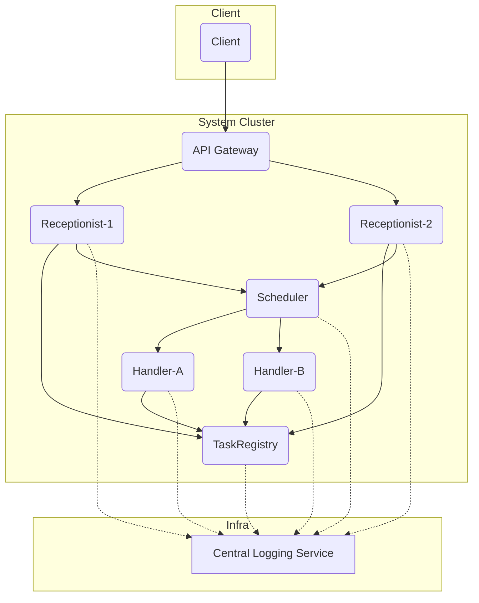

```mermaid
flowchart TD
  subgraph Client
    USER(Client)
  end

  subgraph Infra
    LOGGING[Central Logging Service]
  end

  subgraph System Cluster
    GATEWAY(API Gateway)
    RECEPTIONIST1(Receptionist-1)
    RECEPTIONIST2(Receptionist-2)
    SCHEDULER(Scheduler)
    HANDLER1(Handler-A)
    HANDLER2(Handler-B)
    TASKREGISTRY(TaskRegistry)
  end

  USER --> GATEWAY
  GATEWAY --> RECEPTIONIST1
  GATEWAY --> RECEPTIONIST2
  RECEPTIONIST1 --> TASKREGISTRY
  RECEPTIONIST2 --> TASKREGISTRY
  RECEPTIONIST1 --> SCHEDULER
  RECEPTIONIST2 --> SCHEDULER
  SCHEDULER --> HANDLER1
  SCHEDULER --> HANDLER2
  HANDLER1 --> TASKREGISTRY
  HANDLER2 --> TASKREGISTRY

  RECEPTIONIST1 .-> LOGGING
  RECEPTIONIST2 .-> LOGGING
  SCHEDULER .-> LOGGING
  HANDLER1 .-> LOGGING
  HANDLER2 .-> LOGGING
  TASKREGISTRY .-> LOGGING
```
