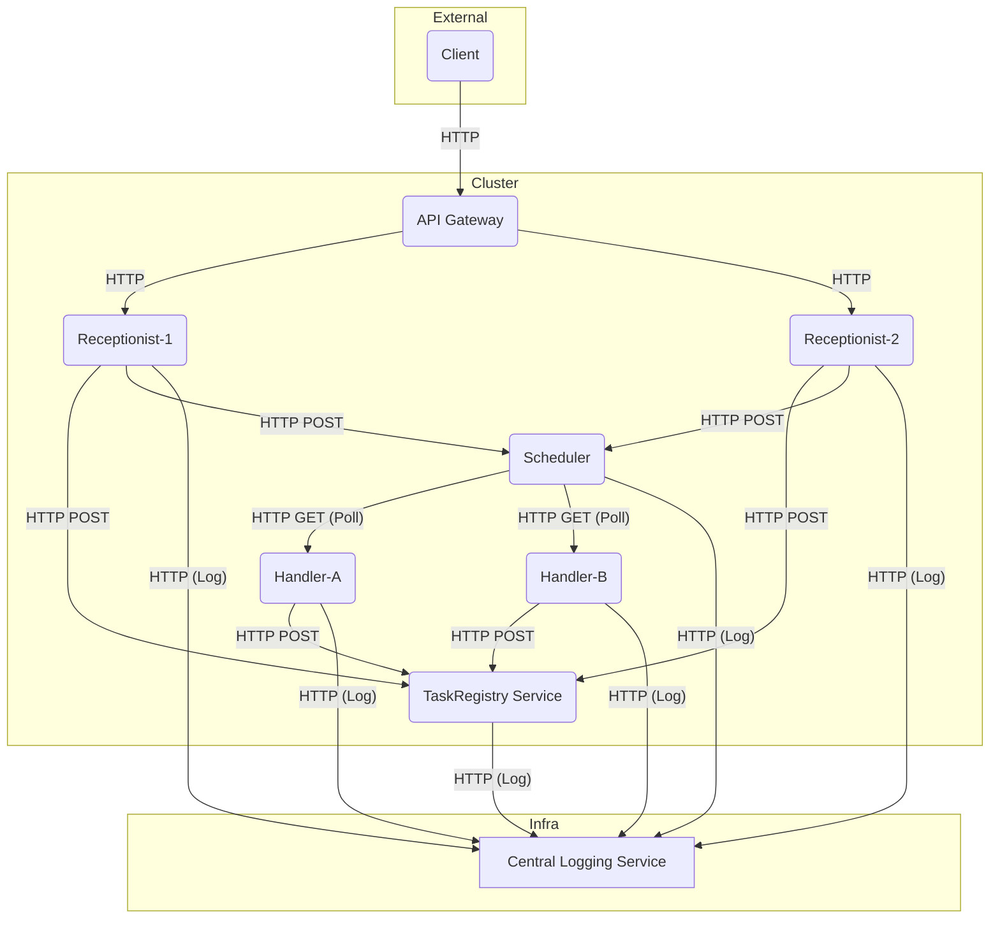

# Receptionist System — Product Requirements Document (PRD)

## Overview

This system handles the import and export of digital books in batch format. It is composed of four core services:

- **API Gateway** — Entry point for all client requests, provides load balancing, rate limiting, and bot filtering
- **Receptionist** — Public-facing REST API gateway (behind API Gateway)
- **Scheduler** — In-memory queue manager
- **Handler** — Workers that process jobs
- **TaskRegistry** — In-memory job store with ORM-like interface
- **Central Logging Service** — NodeJS+Express service for collecting logs from all services

The system is horizontally scalable, decoupled, and each service communicates via HTTP. All logs are piped to the Central Logging Service, simulating a real microservices architecture.

---

## Architecture

### Diagram (Mermaid Syntax)



---

---

## Services

### 1. API Gateway

- Framework: Express (NodeJS)
- Role: Entry point for all client requests. Handles load balancing between Receptionist instances, provides rate limiting and bot filtering for security. Forwards valid requests to Receptionist.
- (Optional) Could provide API keys or JWT validation.

---

### 2. Receptionist

- Framework: Express
- Role: Accepts and validates requests from API Gateway, creates job records in TaskRegistry, sends jobs to Scheduler
- Exposes Swagger UI at `/docs`
- All logs are piped to Central Logging Service

##### POST `/exports`

Submit a new export job

```json
{
  "bookId": "string-uuid",
  "type": "epub" | "pdf"
}
```

Response:

```json
{
  "jobId": "string-uuid"
}
```

##### POST `/imports`

Submit a new import job

```json
{
  "bookId": "string-uuid",
  "type": "word" | "pdf" | "wattpad" | "evernote",
  "url": "https://source.com/input.docx"
}
```

Response:

```json
{
  "jobId": "string-uuid"
}
```

##### GET `/exports` and `/imports`

Grouped job listings by state:

```json
{
  "pending": [...],
  "processing": [...],
  "finished": [...],
  "failed": [...]
}
```

---

### 3. Scheduler

- Framework: Express
- Role: In-memory FIFO queue per job type. BullMQ-like interface. Dispatches to Handlers.
- All logs are piped to Central Logging Service

#### Endpoint

##### POST `/queue`

Enqueue a job

```json
{
  "id": "string-uuid",
  "direction": "import" | "export",
  "type": "epub" | "pdf" | "word" | "wattpad" | "evernote"
}
```

Response: `204 No Content`

---

### 4. Handler

- Framework: Node.js
- Role: Long-poll or subscribe to Scheduler, process job with simulated delay, update TaskRegistry
- Not exposed via HTTP
- All logs are piped to Central Logging Service

#### Processing times

| Job type       | Delay (s) |
| -------------- | --------- |
| `epub`         | 10        |
| `pdf` (export) | 25        |
| `import`       | 60        |

---

### 5. TaskRegistry

- Framework: Express
- DB: In-memory database with ORM-like interface (no SQLite)
- Role: Owns the job table in memory, handles create/update/query
- All logs are piped to Central Logging Service

#### Endpoints

##### POST `/jobs`

Create a new job

```json
{
  "id": "string",
  "bookId": "string",
  "direction": "import" | "export",
  "type": "epub" | "pdf" | "word" | "wattpad" | "evernote",
  "sourceUrl": "string (only for import)"
}
```

##### PATCH `/jobs/:id`

Update job state or result

```json
{
  "state": "processing" | "finished" | "failed",
  "resultUrl": "string"
}
```

##### GET `/jobs?direction=import|export`

Return grouped job states

```json
{
  "pending": [...],
  "processing": [...],
  "finished": [...],
  "failed": [...]
}
```

##### (Optional) GET `/jobs/:id`

Fetch job detail

---

## Types (Shared Across Services)

```ts
type JobDirection = "import" | "export";
type JobType = "epub" | "pdf" | "word" | "wattpad" | "evernote";
type JobState = "pending" | "processing" | "finished" | "failed";

type Job = {
  id: string;
  bookId: string;
  direction: JobDirection;
  type: JobType;
  state: JobState;
  sourceUrl?: string;
  resultUrl?: string;
  createdAt: string;
  updatedAt: string;
  startedAt?: string;
};
```

---

## Central Logging Service

- Framework: Express (NodeJS)
- Role: Receives logs from all services via HTTP (e.g., POST `/logs`). Stores logs in memory or streams to disk for development/testing. Provides endpoints for querying logs (optional).
- All services should use a common logging interface/library to send logs to this service.
- Example log format:

```json
{
  "timestamp": "2025-07-08T19:35:36+01:00",
  "service": "receptionist",
  "level": "info",
  "message": "Job created",
  "meta": { "jobId": "uuid" }
}
```

---

## Notes

- All APIs are HTTP/JSON
- All filenames must use **kebab-case**
- All services are Express-based
- Swagger UI is served at `/docs` on each service for testing and documentation
- TaskRegistry uses an in-memory DB with ORM-like interface (no SQLite or external DB)
- Central Logging Service receives logs from all services via HTTP
- API Gateway is the entry point for all client traffic, providing load balancing, rate limiting, and bot filtering
- All filenames must use **kebab-case**
- All services are Express-based
- Swagger UI is served at `/docs` on each service for testing and documentation
- Queue implementation is in-memory with BullMQ-style interface, no Redis or 3rd-party queues
- the source code is in the `src` directory
- each service is in a separate directory under src with their independent package.json
- the services are built and run using `npm run build` and `npm run start`
- the services are horizontally scalable, i.e. stateless, except scheduler and task-registry
- the scheduler is a singleton, i.e. it should only run one instance at a time
- the task-registry is a singleton, i.e. it should only run one instance at a time
