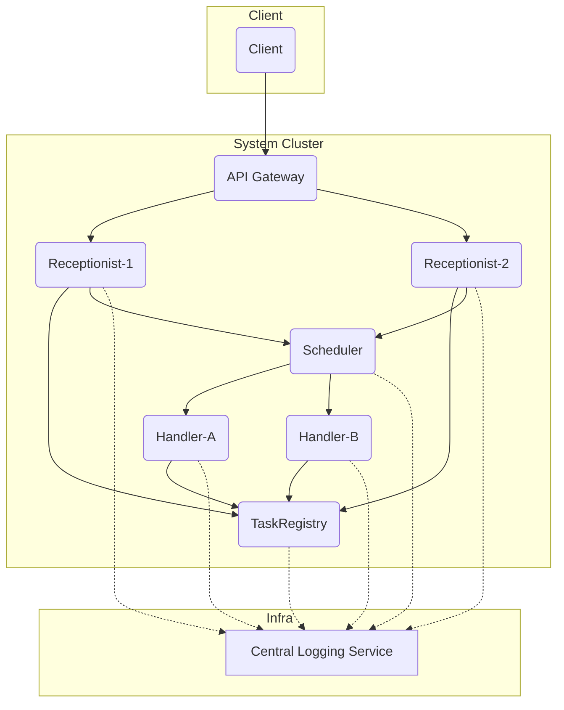

# reedsy-2025-import-export

## Overview

The Import-Export System is a horizontally scalable, decoupled architecture for handling import and export of digital books. It processes user-submitted jobs via stateless services coordinated through an in-memory queue and in-memory job store. The design allows for flexibility, observability, and horizontal scalability.

All services communicate over HTTP and are implemented using Node.js with Express. Logs are piped to a central logging service to simulate a real-world microservices architecture.

## Goals

- Accept and queue import/export jobs with validation.
- Process jobs asynchronously with simulated delays based on job type.
- Track job lifecycle (`pending`, `processing`, `finished`, `failed`) and provide status queries.
- Design with extensibility and production readiness in mind.
- Simulate real-world patterns like load balancing, rate limiting, and centralised logging.

The system consists of six services:

- **API Gateway**: Handles routing, rate limiting. It uses round-robin load balancing with hard-coded targets (for now), but can be replaced with Kong.
- **Receptionist**: API Frontend that validates and queues jobs. Can be horizontally scaled.
- **Scheduler**: Central FIFO queue for job dispatch. In-memory for now but can be easily replaced as it adheres to a common interface based on RabbitMQ.
- **Handler**: Worker processes that simulate job processing. Can be horizontally scaled.
- **TaskRegistry**: Central store tracking all job records. In-memory for now but can be easily replaced as it adheres to a common interface for CRUD operations.
- **Central Logging Service**: Collects logs from all other services. Currently using Express.js but can be easily replaced with a more advanced logging service.

### Diagram



## Setup

```bash
nvm install
npm install
npm run dev # run all services using ts-node on local machine
npm run test # run tests for all services
npm run lint # run lint for all services
```

## Manual testing

```bash
curl -X 'POST' 'http://localhost:3001/api/receptionist/exports' \
  -H 'accept: */*' \
  -H 'Content-Type: application/json' \
  -d '{"bookId": "123", "type": "epub"}'
```

# Component design in detail

### 1. API Gateway

- **Role**: Entry point for client requests.
- **Features**:
  - Load balancing (round-robin)
  - Rate limiting
- **Notes**:
  - Hardcoded Receptionist targets
  - Easily replaceable with Kong/Nginx in production

---

### 2. Receptionist

- **Role**: Accepts import and export requests, mutates job status to "pending", registers the job in the Task Registry, and adds the job to the Scheduler
- **Responsibilities**:
  - Parses and validates payloads
  - Appends `requestId` (UUID) to logs
  - Submits job to both TaskRegistry and Scheduler
- **Endpoints**:
  - `POST /exports`
  - `POST /imports`
  - `GET /exports`
  - `GET /imports`
  - `GET /health`

---

### 3. Scheduler

- **Role**: Manages FIFO queues for jobs
- **Design**:
  - In-memory job queue
  - Interface designed to support RabbitMQ/BullMQ in future
- **Endpoints**:
  - `POST /queue`
  - `POST /queue/dequeue`
  - `GET /status`
  - `GET /health`

---

### 4. Handler

- **Role**: Pulls jobs from Scheduler and simulates processing
- **Behavior**:
  - Polls `POST /queue/dequeue`
  - Updates job state in TaskRegistry
  - Sends logs to Central Logging
- **Job simulation**:
  - `epub`: 10s
  - `pdf`: 25s
  - `import` (any): 60s

---

### 5. TaskRegistry

- **Role**: In-memory store for job states
- **Design**:
  - In-memory DB with ORM-like CRUD interface
  - Supports `POST`, `PUT`, `GET`
- **Endpoints**:
  - `POST /jobs`
  - `PUT /jobs/:id`
  - `GET /jobs`

---

### 6. Central Logging Service

- **Role**: Receives logs from all services
- **Format**:
  ```json
  {
    "timestamp": "2025-07-08T19:35:36+01:00",
    "service": "receptionist",
    "level": "info",
    "message": "Job created",
    "meta": { "jobId": "uuid" }
  }
  ```

---

## Data Flow

1. **Client submits job** via `POST /exports` or `POST /imports` to API Gateway.
2. **API Gateway** forwards to a Receptionist instance.
3. **Receptionist**:
   - Validates payload
   - Registers job in TaskRegistry (state: `pending`)
   - Enqueues job in Scheduler
4. **Handler** polls Scheduler and processes job:
   - Updates state to `processing`
   - Simulates delay
   - Updates state to `finished` or `failed`
   - Adds `resultUrl` for export/import result
5. **Client queries job** via `GET /imports` or `GET /exports` to API Gateway.
6. **Central Logging Service** receives logs throughout.

## If I had more time

- Implement monitoring and a dashboard to monitor the system
  - There's already a status endpoint on each service. For example, the queue service has a /status endpoint which returns the current state of the queue. Likewise, the Handler has a /status endpoint which returns the current state of the handler.
  - Each service also has a health check endpoint at /health which returns a 200 OK if the service is healthy.
- Implement service registration and discovery
  - Use a service registry to register and discover services so that for example one can spawn multiple Receptionist services and the API Gateway can discover them. Or one can spawn multiple Handler services when the queue exceeds a certain threshold.
